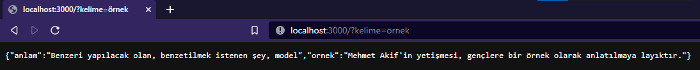

# TDK API (UNOFFICIAL)

An unofficial TDK verified words api

## What is TDK ?

- 🇹🇷 : Türk Dil Kurumu

- 🇺🇸 : Turkish Language Organisation

## Examples

### Success



### Error


## Install

```bash
git clone https://github.com/mertssmnoglu/TDK-Api.git
# Clone the app with git clone
```

```bash
cd TDK-Api
# Change the current directory to TDK-Api
```

```bash
cp .env.example .env
# Copy .env.example and rename it to .env
```

! Please do not forget to change the PORT and USER_AGENT

How can i get my user agent? Please [click on it](https://www.whatismybrowser.com/detect/what-is-my-user-agent/)

```bash
yarn
# Install all dependencies
```

```bash
yarn dev
# Visit localhost:PORT with your browser
```

## License

MIT
